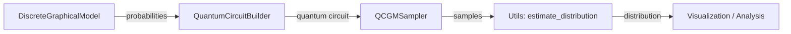

# Architecture Overview

This document describes the structure and organization of the QuantumDGM codebase.

## Project Structure

```
QuantumDGM/
├── qcgm/                      # Core library package
│   ├── __init__.py            # Package exports and convenience functions
│   ├── model.py               # DiscreteGraphicalModel class
│   ├── circuit.py             # Quantum circuit builders
│   ├── sampler.py             # QCGMSampler class
│   ├── statistics.py          # Pauli-Markov statistics
│   ├── utils.py               # Utility functions
│   └── visualization.py       # Plotting and diagrams
├── examples/                  # Demonstrations and tutorials
│   ├── demo_script.py         # Basic functionality demo
│   ├── quantum_vs_classical_demo.py  # Comparison demo
│   ├── variational_training_demo.py  # Large model training
│   ├── demo_notebook.ipynb    # Interactive tutorial
│   └── tests/                 # Test suite
├── docs/                      # Documentation (this folder)
├── setup.py                   # Package installation
├── requirements.txt           # Dependencies
└── README.md                  # Project overview
```

---

## Core Modules

### `model.py` - Graphical Model Representation

**Main Class:** `DiscreteGraphicalModel`

Represents a discrete graphical model over binary variables using the exponential family formulation:

```
P_θ(X = x) = (1/Z(θ)) exp(∑_{C∈𝒞} ∑_{y∈𝒳_C} θ_{C,y} φ_{C,y}(x))
```

**Key Features:**
- Sparse diagonal Hamiltonian computation (O(2^n) memory)
- Cached probability computation
- Exact sampling for ground truth comparison

---

### `circuit.py` - Quantum Circuit Construction

**Main Classes:**
- `QuantumCircuitBuilder` - Exact circuits via amplitude encoding
- `ApproximateCircuitBuilder` - Variational circuits for large models

**Approach:**
1. **Exact (n ≤ 10):** Direct state initialization with amplitude encoding
2. **Approximate (n > 10):** Hardware-efficient ansatz with optimization

---

### `sampler.py` - Quantum Sampling

**Main Class:** `QCGMSampler`

Provides the primary interface for drawing samples from quantum circuits.

**Features:**
- Handles qubit ordering (Qiskit uses little-endian)
- Support for simplified and full circuits
- Retry mechanism for target sample counts

---

### `statistics.py` - Pauli-Markov Statistics

**Main Class:** `PauliMarkovStatistics`

Implements Algorithm 1 from the paper for computing Φ_{C,y} matrices.

---

### `utils.py` - Utility Functions

**Key Functions:**
- `compute_fidelity()` - Distribution similarity
- `kl_divergence()` - KL divergence
- `estimate_distribution()` - Convert samples to distribution
- `compare_distributions()` - Comprehensive comparison

---

### `visualization.py` - Visualization Tools

**Key Functions:**
- `visualize_graphical_model()` - Plot model structure
- `visualize_circuit_diagram()` - Simplified circuit view
- `plot_distribution_comparison()` - Compare distributions

---

## Data Flow



1. **Model Definition:** Create `DiscreteGraphicalModel` with cliques and parameters
2. **Circuit Building:** `QuantumCircuitBuilder` creates circuit from model probabilities
3. **Sampling:** `QCGMSampler` executes circuit on backend (simulator/hardware)
4. **Analysis:** Utility functions compare samples to exact distribution

---

## Design Decisions

### Sparse Hamiltonian
The Hamiltonian H_θ is diagonal, so we store only O(2^n) elements instead of the full O(4^n) matrix.

### Qubit Ordering
Qiskit uses little-endian bit ordering. The library handles reordering internally to match the model's state indexing.

### Variational Training
For n > 10, exact amplitude encoding becomes impractical. The library uses COBYLA optimization with KL divergence loss to train variational circuits.

---

## See Also

- [API Reference](api_reference.md) - Detailed class documentation
- [Graphical Models](graphical_models.md) - Theory background
